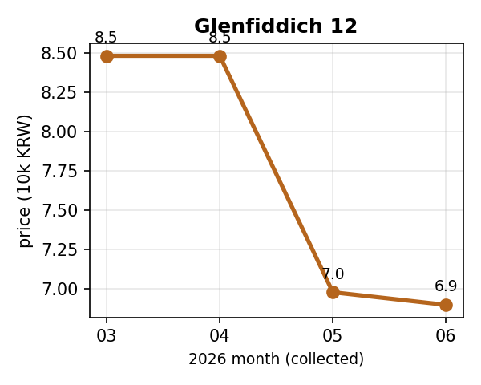
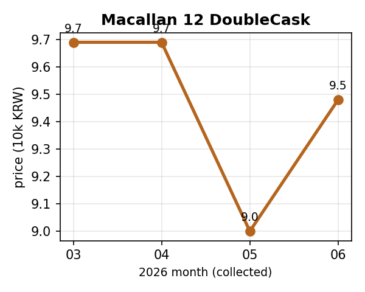
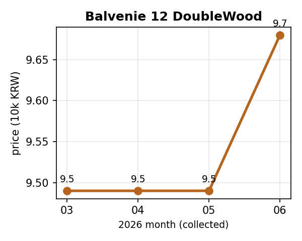

> **DRAFT / 미발행.** CMPA-275 Phase-0 데이터 기반. 발행 전 보드 커밋레벨 결정 + 수집일·환율 방향 재확인 필수.
> 차트: `_drafts/assets/price-trend/*.png` (모바일 우선, romanized 라벨 — 라이브 발행 시 한글 폰트 차트로 교체).

## 결론 먼저 — "싸다"보다 "왜 싼지"를 본다
같은 병도 세일·환율·재고에 따라 출렁인다. 우리는 한 시점이 아니라 **수집 날짜가 찍힌 누적
기록**으로 쌓아 왔고(데이터 3원칙), 그걸로 각 병을 **두 축**으로 읽는다:

1. **위치군 (지금 어디?)** — 그 병의 **자기 3~4개월 최저가 범위** 안에서 현재가 위치:
   **비싼군**(고점 근처) · **애매한군**(중간) · **저렴한군**(저점 근처).
2. **궤적 (어떻게 거기 왔나?)** — **↩️되돌림**(세일·환율로 떨어졌다 멈춤/반등) vs
   **⬇️하락추세**(클리어런스·단종으로 계속 미끄러짐).

매수 가이드는 이 둘의 곱이다:

| 위치군 | 궤적 | 매수 가이드 |
|---|---|---|
| 저렴한군 | ↩️되돌림(일시 세일·환율) | ✅ **지금이 매수창** |
| 저렴한군 | ⬇️하락추세(클리어런스·단종) | ⚠️ **더 빠질 수 있음** — 마실 거면 사고(재고소진·단종 위험), 묵힐 거면 관망 |
| 애매한군 | — | ⏸️ 관망 |
| 비싼군 | — | ⛔ 대기 |

## "저렴한군 들어오면 더 떨어지지 않나?" — 우리 데이터의 답
국내 4개월 최저가 시계열로 **월별 변동의 지속성**을 측정했다(84병·MoM 147건·연속쌍 63):
- **지연-1 자기상관 r = −0.37** → **되돌림이 우세**(추세지속 아님).
- **3%↑ 하락 직후: 80%(12/15)가 다음 달 반등**, 더 떨어진 건 20%(3/15)뿐.
- 그리고 지금 **저렴한군 18종 중 '연속 하락추세'는 0종** — 대부분 **떨어진 뒤 평탄화**
  (세일가가 굳음). 즉 저렴한군 진입은 **대체로 진짜 매수창**이다. 더 빠지는 건 예외(클리어런스·단종).

> *정직 단서: 표본이 작다(4개월·연속쌍 63·하락 15). 방향성은 분명하나 **예비 결과**다.
> 누적될수록 강해진다.*

## 추이 그래프 — 대표 병 (국내 최저가, 만원)
- **Glenfiddich 12 (글렌피딕 12년)**: 85 → 85 → 70 → 69 → 5월 세일이 6월까지 **굳음**.
  저렴한군 · ↩️되돌림 = **매수창**. 
- **Macallan 12 DoubleCask (맥캘란 12년 더블캐스크)**: 97 → 97 → 90 → 95 → 잠깐 빠졌다 복귀.
  애매한군 · ↩️되돌림 = 관망. 
- **Balvenie 12 DoubleWood (발베니 12년 더블우드)**: 95 → 95 → 95 → 97 → 거의 안 움직임.
  비싼군(자기 범위 고점) = 대기. 

## 지금 군집 스냅샷 (2026-06 기준, 3개월+ 누적 46종)
군집 분포: **저렴한군 18 · 애매한군 4 · 비싼군 16 · 변동없음 8**

| 위스키 | 개월 | 월별 최저가(천원) | 위치군 | 궤적 |
|---|---|---|---|---|
| 글렌피딕 12년 | 4 | 85 → 85 → 70 → 69 | **저렴한군** | ↩️되돌림(하락후 평탄) |
| 발렌타인 21년 | 4 | 187 → 225 → 183 → 182 | **저렴한군** | ↩️되돌림(하락후 평탄) |
| 발렌타인 17년 | 4 | 119 → 119 → 120 → 101 | **저렴한군** | ⬇️하락(1개월) |
| 1792 스몰배치 | 3 | 40 → 45 → 40 | **저렴한군** | ↩️되돌림(상승후 꺾임) |
| 글렌그란트 12년 | 3 | 60 → 59 → 59 | **저렴한군** | → 횡보 |
| 글렌드로낙 12년 | 3 | 80 → 89 → 77 | **저렴한군** | ↩️되돌림(상승후 꺾임) |
| 글렌리벳 15년 | 3 | 95 → 95 → 89 | **저렴한군** | ⬇️하락(1개월) |
| 러셀스 리저브 싱글배럴 | 3 | 90 → 89 → 89 | **저렴한군** | → 횡보 |
| 발렌타인 싱글몰트 15년 | 3 | 95 → 95 → 87 | **저렴한군** | ⬇️하락(1개월) |
| 뱅크홀 싱글몰트 | 3 | 38 → 30 → 30 | **저렴한군** | ↩️되돌림(하락후 평탄) |
| 에반 윌리엄스 12년 | 3 | 100 → 90 → 89 | **저렴한군** | ↩️되돌림(하락후 평탄) |
| 와일드터키 레어브리드 | 3 | 80 → 80 → 75 | **저렴한군** | ⬇️하락(1개월) |
| 탈리스커 와일드 블루 | 3 | 75 → 69 → 69 | **저렴한군** | ↩️되돌림(하락후 평탄) |
| 로얄 살루트 21년 | 3 | 280 → 180 → 180 | **저렴한군** | ↩️되돌림(하락후 평탄) |
| 이글 레어 10년 | 3 | 75 → 70 → 70 | **저렴한군** | ↩️되돌림(하락후 평탄) |
| 글렌파클라스 15년 | 3 | 119 → 119 → 113 | **저렴한군** | ⬇️하락(1개월) |
| 짐빔 화이트 | 4 | 20 → 28 → 20 → 20 | **저렴한군** | ↩️되돌림(하락후 평탄) |
| 조니워커 블랙 루비 | 3 | 53 → 45 → 45 | **저렴한군** | ↩️되돌림(하락후 평탄) |
| 발렌타인 10년 | 3 | 32 → 40 → 34 | **애매한군** | ↩️되돌림(상승후 꺾임) |
| 조니워커 블랙라벨 12년 | 4 | 48 → 37 → 41 → 41 | **애매한군** | → 횡보 |
| 듀어스 12년 | 4 | 43 → 35 → 40 → 39 | **애매한군** | ↩️되돌림(상승후 꺾임) |
| 맥캘란 12년 더블캐스크 | 4 | 97 → 97 → 90 → 95 | **애매한군** | ↩️되돌림(반등) |
| 글렌모렌지 12년 | 4 | 80 → 70 → 80 → 78 | **비싼군** | ↩️되돌림(상승후 꺾임) |
| 글렌피딕 15년 | 4 | 97 → 97 → 97 → 100 | **비싼군** | ⬆️상승 |
| 발베니 12년 더블우드 | 4 | 95 → 95 → 95 → 97 | **비싼군** | ⬆️상승 |
| 제임슨 | 4 | 27 → 27 → 27 → 28 | **비싼군** | ⬆️상승 |
| 조니워커 블루라벨 | 4 | 257 → 257 → 257 → 260 | **비싼군** | → 횡보 |
| 몽키숄더 | 4 | 42 → 42 → 42 → 50 | **비싼군** | ⬆️상승 |
| 조니워커 그린라벨 15년 | 4 | 67 → 66 → 70 → 70 | **비싼군** | → 횡보 |
| 발베니 14년 캐리비안 캐스크 | 4 | 135 → 135 → 135 → 144 | **비싼군** | ⬆️상승 |
| 산토리 가쿠빈 | 4 | 28 → 28 → 28 → 30 | **비싼군** | ⬆️상승 |
| 잭다니엘 라이 | 3 | 56 → 40 → 63 | **비싼군** | ↩️되돌림(반등) |
| 라프로익 10년 | 4 | 70 → 70 → 70 → 72 | **비싼군** | ⬆️상승 |
| 러셀스 리저브 10년 | 3 | 70 → 59 → 99 | **비싼군** | ↩️되돌림(반등) |
| 라가불린 11년 오퍼맨 스위트피트 | 3 | 90 → 90 → 95 | **비싼군** | ⬆️상승 |
| 클라이넬리시 14년 | 3 | 79 → 85 → 85 | **비싼군** | → 횡보 |
| 글렌알라키 10년 루비 포트 | 3 | 90 → 90 → 185 | **비싼군** | ⬆️상승 |
| 에버펠디 16년 | 3 | 76 → 76 → 96 | **비싼군** | ⬆️상승 |
| 로얄 브라클라 12년 | 3 | 83 → 83 → 83 | **변동없음** | → 횡보 |
| 달모어 12년 셰리캐스크 | 3 | 145 → 145 → 145 | **변동없음** | → 횡보 |
| 글렌피딕 14년 버번배럴 | 3 | 100 → 100 → 100 | **변동없음** | → 횡보 |
| 듀어스 15년 | 3 | 59 → 59 → 59 | **변동없음** | → 횡보 |
| 아란 셰리 캐스크 | 3 | 100 → 100 → 100 | **변동없음** | → 횡보 |
| 와일드터키 켄터키 스피릿 싱글배럴 | 3 | 69 → 69 → 69 | **변동없음** | → 횡보 |
| 카발란 디스틸러리 셀렉트 | 3 | 70 → 70 → 70 | **변동없음** | → 횡보 |
| 포 로지스 스몰배치 셀렉트 | 3 | 117 → 117 → 117 | **변동없음** | → 횡보 |

## 그래서 30초 체크
1. 이 병, 자기 역대 대비 **어디**냐(저점이면 저렴한군)?
2. 거기 **어떻게** 왔냐 — 세일로 떨어졌다 멈춤(↩️ 매수창)이냐, 계속 미끄러지냐(⬇️ 더 빠질라)?
3. 수집일 신선한가 · 환율 방향은(면세·해외)?

→ 우리 위스키 가격 리포트(앱) · 신라 가격변동 패치 글로 연결.

---
*담백하게, 데이터 중심으로. 발행 전 수집일·환율 재확인.*
